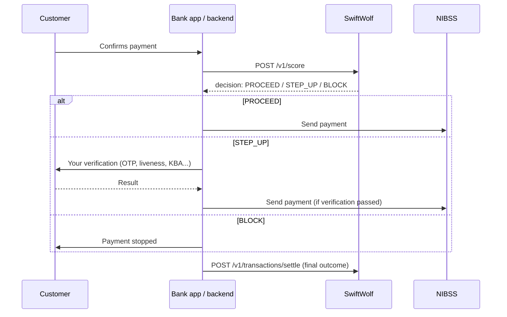

# SwiftWolf Integration Guide

This guide is for developers at a bank connecting their app and payment backend to SwiftWolf. It covers the two calls you make for every payment, what to send, and what to do with each answer.

For the field-by-field schema, a running SwiftWolf instance serves interactive API docs at `/docs`.

---

## 1. What SwiftWolf does

SwiftWolf checks each outgoing payment for signs of fraud and tells you whether it looks like your customer. It **advises; it never moves money**. Your app stays in control of every payment.

For each payment, SwiftWolf answers with one of three decisions:

| Decision | Meaning | What you do |
|---|---|---|
| `PROCEED` | Looks like the customer's normal behaviour | Send the payment |
| `STEP_UP` | Unusual enough to confirm it's really the customer | Verify the customer with your own method, then send or cancel |
| `BLOCK` | High risk | Stop the payment |

SwiftWolf learns each customer's normal behaviour (who they pay, how much, from where) from payments you report back as settled. The more complete your reporting, the better its decisions for that customer.

## 2. The flow

You make **two calls per payment**, linked by the same `transaction_reference`:



1. **Score** after the customer confirms the payment and **before** you send it to NIBSS.
2. **Act** on the decision.
3. **Settle** once the outcome is final: the payment went through, or it didn't. Do this for **every scored payment**, including `PROCEED` ones and ones that failed or were cancelled.

> **Settle every payment.** SwiftWolf only learns from payments you settle as `SUCCESS`. If you only report stepped-up payments, it never learns what is normal for your customers, and their everyday payments keep looking new.

## 3. Authentication

Every request must include your API key in the `X-SwiftWolf-Key` header:

```
X-SwiftWolf-Key: <your-api-key>
```

| Response | Cause |
|---|---|
| `401` `{"detail": "Invalid or missing X-SwiftWolf-Key"}` | The header is missing or the key is wrong |
| `500` `{"detail": "API key not configured on server"}` | SwiftWolf itself is misconfigured; contact the SwiftWolf team |

Keep the key on your backend. Don't ship it inside a mobile app.

### Checking SwiftWolf is up

`GET /` on the base URL needs no key and returns `200` with `{"status": "ok", "service": "SwiftWolf"}` while the service is running. Use it for uptime monitoring or a connectivity check during setup.

## 4. Score a payment: `POST /v1/score`

### Request

```json
{
  "transaction_reference": "txn_ref_a1b2c3",
  "customer_id": "cust_123",
  "provider": "000013",
  "recipient": "0123456789",
  "amount": 20000000,
  "timestamp": "2026-07-11T02:17:00Z",
  "transaction_type": "transfer",
  "medium": "app",
  "last_transaction_timestamp": "2026-07-10T02:17:00Z",
  "geolocation": { "lat": 6.5244, "lng": 3.3792 },
  "session": {
    "login_to_transfer_seconds": 14.2,
    "pasted_beneficiary": false
  },
  "behavioural_biometrics": {
    "dwell_time_ms": 120.5,
    "flight_time_ms": 85.0,
    "time_to_first_keystroke_ms": 340.0,
    "backspace_count": 2
  }
}
```

### Required fields

| Field | Type | Description |
|---|---|---|
| `transaction_reference` | string, max 64 chars | Your unique ID for this payment attempt. Reused in the settle call. |
| `customer_id` | string, max 64 chars | Your stable ID for the customer. Must be the same on every payment by that customer. |
| `provider` | string, max 30 chars | Who the money goes through (see the table below). |
| `recipient` | string, max 50 chars | Who receives the money (see the table below). |
| `amount` | integer | Amount in **kobo**: ₦200,000.00 → `20000000`. Must be a whole number greater than 0. |
| `timestamp` | ISO 8601 date-time with timezone | When the customer initiated the payment, e.g. `2026-07-11T02:17:00Z`. |
| `transaction_type` | string | One of `transfer`, `airtime`, `data`, `electricity`, `cable_tv`, `betting`. Lowercase. |
| `medium` | string | The channel: `app` or `ussd`. |

#### What `provider` and `recipient` mean for each type

| `transaction_type` | `provider` | `recipient` |
|---|---|---|
| `transfer` | Destination bank code, e.g. `058` | NUBAN account number |
| `airtime`, `data` | Mobile network, e.g. `MTN` | Phone number |
| `electricity` | DISCO, e.g. `IKEDC` | Meter number |
| `cable_tv` | Provider, e.g. `DSTV` | Smartcard / IUC number |
| `betting` | Platform | Customer's account ID on the platform |

Use the same format every time for the same destination (for example, always the same phone-number format). SwiftWolf recognises a returning recipient by an exact match on `provider` + `recipient`, so `08031234567` and `+2348031234567` count as two different recipients. Airtime and data to the same phone number count as the same recipient.

### Optional fields

These are optional, but each one lets SwiftWolf check for more kinds of fraud. Without them, those checks simply don't run.

| Field | What to send | What it enables |
|---|---|---|
| `last_transaction_timestamp` | When this customer last made any payment (ISO 8601 with timezone) | Spotting dormant accounts that suddenly send unusual amounts |
| `geolocation` | `{ "lat": <number>, "lng": <number> }` of the device, if you have it | Spotting payments from far outside where the customer usually banks |
| `session.login_to_transfer_seconds` | Seconds between the customer logging in and confirming this payment | Spotting automated attacks that act faster than a person could |
| `session.pasted_beneficiary` | `true` if the account number was pasted rather than typed or picked | Spotting a common scam pattern when paying someone new |
| `behavioural_biometrics` | An object containing `dwell_time_ms`, `flight_time_ms`, `time_to_first_keystroke_ms`, and `backspace_count` | Records behavioural telemetry alongside the risk event for analysis |

If you send `session`, include **both** of its fields.

`behavioural_biometrics` is optional. If you provide it, include all four fields. Durations are in milliseconds; `backspace_count` is the number of backspaces. SwiftWolf records these values as telemetry; they do **not currently affect the score or decision**. Do not send raw keystrokes.

### Response

```json
{
  "transaction_reference": "txn_ref_a1b2c3",
  "score": 45,
  "decision": "STEP_UP",
  "reasons": ["new_beneficiary", "new_bank"]
}
```

| Field | Description |
|---|---|
| `decision` | `PROCEED`, `STEP_UP` or `BLOCK`. **Act on this field.** |
| `reasons` | Why the payment scored as it did (codes below). Useful for logs, support teams, and messages to the customer. |
| `score` | The internal risk score. It's informational; the scale and cut-offs may change, so don't build logic on the number. |

#### Reason codes

| Code | Meaning |
|---|---|
| `blacklisted_account` | The destination account is on the fraud blocklist. Always a `BLOCK`. |
| `elevated_risk_tier` | This customer is flagged for extra scrutiny. |
| `new_beneficiary` | First payment by this customer to this recipient. |
| `new_bank` | First transfer by this customer to this bank. |
| `amount_deviation` | The amount is unusual for this customer and this type of payment. |
| `high_velocity_burst` | Many payments from this customer in a short time. |
| `bot_speed_timing` | Confirmed too soon after login to be a person. Needs `session`. |
| `pasted_new_beneficiary` | A new recipient whose account number was pasted. Needs `session`. |
| `dormant_account_spike` | An inactive account suddenly sending an unusual amount. Needs `last_transaction_timestamp`. |
| `location_deviation_minor` | Paying from somewhat far from the customer's usual locations. Needs `geolocation`. |
| `location_deviation_major` | Paying from very far from the customer's usual locations. Needs `geolocation`. |
| `unusual_hour` | Paying at an unusual time for this customer. Reserved: not currently returned. |

New codes may be added in future. Treat an unknown code as informational rather than an error.

## 5. What to do with each decision

**`PROCEED`**: send the payment to NIBSS as normal.

**`STEP_UP`**: verify that it's really the customer before sending. **You choose the method** based on your channel and what you support, for example an OTP, a BVN liveness (face) check in the app, or knowledge-based questions on USSD. If verification passes, send the payment. If it fails or the customer abandons it, don't. Either way, report what happened in the settle call (see [verification reporting](#reporting-verification)).

**`BLOCK`**: don't send the payment. When the reasons include `blacklisted_account`, **don't offer a step-up**: verification proves the sender is the real customer, but the problem is the destination, and a customer being tricked by a scammer would pass their own verification.

**If SwiftWolf is unavailable or slow to respond:** what to do is your bank's decision. You can proceed without a score (the payment goes through, but it isn't checked) or step up / hold the payment (safer, but it affects every customer during an outage). Set a timeout on the score call that fits your payment flow, and decide your policy for when it's exceeded.

## 6. Report the outcome: `POST /v1/transactions/settle`

Call this once the payment's outcome is final. Everything about the payment itself (customer, amount, destination, type, channel) is taken from the score call, so you only send what you learned afterwards.

### Request

```json
{
  "transaction_reference": "txn_ref_a1b2c3",
  "settled_at": "2026-07-11T02:19:00Z",
  "status": "SUCCESS",
  "verification_method": "liveness",
  "verification_outcome": "passed"
}
```

| Field | Required | Description |
|---|---|---|
| `transaction_reference` | Yes | The reference you scored. |
| `settled_at` | Yes | When the outcome was final (ISO 8601 with timezone). |
| `status` | No, defaults to `SUCCESS` | `SUCCESS` if the money moved. `FAILED` if it didn't: declined, cancelled, verification failed, or NIBSS rejected it. |
| `verification_method` | Only after a step-up | `otp`, `liveness` or `kba` (knowledge-based questions). |
| `verification_outcome` | Only after a step-up | `passed`, `failed` or `abandoned` (the customer didn't finish). |

<a id="reporting-verification"></a>
#### Reporting verification

- After a step-up, send **both** `verification_method` and `verification_outcome`. Sending only one is rejected with `422`.
- When there was no step-up (a `PROCEED` payment), leave both out.
- Report what actually happened, even when the payment then failed, for example `"status": "FAILED"`, `"verification_method": "otp"`, `"verification_outcome": "failed"`. This is used for dispute investigations and for improving fraud detection.

### Response

```json
{
  "transaction_reference": "txn_ref_a1b2c3",
  "status": "STEP_UP_REQUIRED",
  "is_settled": true,
  "message": "Transaction successfully settled."
}
```

| Field | Description |
|---|---|
| `is_settled` | `true` when a `SUCCESS` settlement has been recorded, `false` after a `FAILED` one. |
| `status` | The payment's status in SwiftWolf: the score-time outcome (`APPROVED`, `STEP_UP_REQUIRED`, `BLOCKED`), or `FAILED` after a failed settlement. |
| `message` | Human-readable summary. |

### What SwiftWolf does with it

- **`SUCCESS`**: the payment is marked settled, and the customer's profile learns from it: the recipient and bank become known, and their typical amounts, locations and activity are updated.
- **`FAILED`**: recorded, but the customer's profile is **not** changed, since no money moved.

## 7. References, retries and duplicates

- **Use a new `transaction_reference` for every payment attempt.** If a customer retries a failed payment, give the retry a new reference and score it again.
- **Scoring is idempotent.** Scoring the same reference again returns the **original** decision, even if other fields have changed. This makes it safe to retry a score call after a network error.
- **Settling is idempotent.** Once a reference is settled as `SUCCESS`, sending it again returns `"Transaction was previously settled."` and changes nothing, so it's safe to retry. Concurrent duplicates are handled safely.
- **Send one final outcome per payment.** Don't settle `FAILED` and later `SUCCESS` for the same reference. If the customer tries again, that's a new payment with a new reference.
- **Only scored references can be settled.** Settling a reference SwiftWolf never scored returns `404`.

## 8. Errors

| Status | When | Retry? |
|---|---|---|
| `401` | Missing or wrong `X-SwiftWolf-Key` | No, fix the key |
| `404` | Settle for a reference that was never scored | No, score it first, or check the reference |
| `422` | The request is invalid (details below) | No, fix the request |
| `500` | Unexpected error inside SwiftWolf | Yes, with backoff. Both calls are safe to retry. |

A `422` from request validation lists every problem in `detail`, with `loc` pointing to the field:

```json
{
  "detail": [
    {
      "type": "int_type",
      "loc": ["body", "amount"],
      "msg": "Input should be a valid integer",
      "input": 200000.5
    }
  ]
}
```

Common causes:
- `amount` sent in naira or with a decimal point (`200000.00`). Send whole kobo: `20000000`.
- `transaction_type` in uppercase (`TRANSFER`) or not in the list.
- `medium` other than `app` or `ussd`.
- `session` sent with only one of its two fields.
- A text field longer than its limit (for example a `transaction_reference` over 64 characters), or empty.
- Only one of `verification_method` / `verification_outcome` on a settle.

Always include a timezone in timestamps (`Z` or an offset such as `+01:00`). A timestamp without one is accepted, but it can be read in the wrong timezone, which affects checks such as dormant accounts.

## 9. Worked examples

All examples use `curl` against `https://<swiftwolf-host>`. Replace the host and key with the values for your environment.

### A. A normal payment that goes through

A customer paying an account they've paid before (and settled) through SwiftWolf:

```bash
curl -X POST https://<swiftwolf-host>/v1/score \
  -H "X-SwiftWolf-Key: $SWIFTWOLF_KEY" -H "Content-Type: application/json" \
  -d '{
    "transaction_reference": "txn_0001",
    "customer_id": "cust_123",
    "provider": "058",
    "recipient": "0123456789",
    "amount": 1500000,
    "timestamp": "2026-07-11T10:00:00Z",
    "transaction_type": "transfer",
    "medium": "app"
  }'
```
```json
{ "transaction_reference": "txn_0001", "score": 0, "decision": "PROCEED", "reasons": [] }
```

Send the payment to NIBSS. Once it's confirmed:

```bash
curl -X POST https://<swiftwolf-host>/v1/transactions/settle \
  -H "X-SwiftWolf-Key: $SWIFTWOLF_KEY" -H "Content-Type: application/json" \
  -d '{ "transaction_reference": "txn_0001", "settled_at": "2026-07-11T10:00:05Z", "status": "SUCCESS" }'
```
```json
{ "transaction_reference": "txn_0001", "status": "APPROVED", "is_settled": true, "message": "Transaction successfully settled." }
```

### B. A step-up that passes

A payment to a recipient at a bank this customer has never paid before. (A brand-new customer's first transfer looks like this too, because every recipient is new to SwiftWolf.)

```json
{ "transaction_reference": "txn_0002", "score": 45, "decision": "STEP_UP", "reasons": ["new_beneficiary", "new_bank"] }
```

Your app runs a liveness check, the customer passes, and the payment goes through. Then settle:

```json
{
  "transaction_reference": "txn_0002",
  "settled_at": "2026-07-11T10:03:10Z",
  "status": "SUCCESS",
  "verification_method": "liveness",
  "verification_outcome": "passed"
}
```

### C. A step-up the customer abandons

Same as B, but the customer closes the app at the OTP screen. The payment is never sent:

```json
{
  "transaction_reference": "txn_0003",
  "settled_at": "2026-07-11T10:07:40Z",
  "status": "FAILED",
  "verification_method": "otp",
  "verification_outcome": "abandoned"
}
```
```json
{ "transaction_reference": "txn_0003", "status": "FAILED", "is_settled": false, "message": "Transaction marked as failed settlement." }
```

### D. A payment to a blocklisted account

```json
{ "transaction_reference": "txn_0004", "score": 999, "decision": "BLOCK", "reasons": ["blacklisted_account"] }
```

Stop the payment and don't offer a step-up. Settle it as `FAILED`, with no verification fields:

```json
{ "transaction_reference": "txn_0004", "settled_at": "2026-07-11T10:09:00Z", "status": "FAILED" }
```

## 10. Integration checklist

- [ ] Score every outgoing payment before it's sent to NIBSS.
- [ ] Use a unique `transaction_reference` per payment attempt, and the same one for its settle call.
- [ ] Send amounts in whole kobo.
- [ ] Keep `customer_id`, `provider` and `recipient` formats consistent across payments.
- [ ] Send the optional fields you have: `geolocation`, `session`, `last_transaction_timestamp`, `behavioural_biometrics`.
- [ ] Act on `decision`, not `score`.
- [ ] Never offer a step-up on a `blacklisted_account` block.
- [ ] Settle **every** scored payment, `SUCCESS` or `FAILED`, including `PROCEED` ones.
- [ ] After a step-up, report both `verification_method` and `verification_outcome`.
- [ ] Decide your bank's policy for when SwiftWolf is unavailable, and set a timeout on the score call.
- [ ] Keep the API key on your backend.
